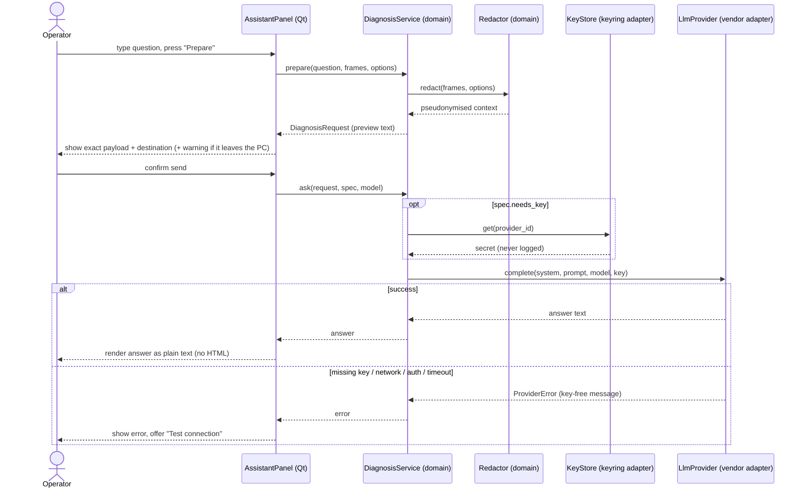

# AI assistant — sequence: ask a diagnosis question (#83)

```mermaid
sequenceDiagram
    actor Op as Operator
    participant UI as AssistantPanel (Qt)
    participant Svc as DiagnosisService (domain)
    participant Red as Redactor (domain)
    participant Keys as KeyStore (keyring adapter)
    participant Prov as LlmProvider (vendor adapter)

    Op->>UI: type question, press "Prepare"
    UI->>Svc: prepare(question, frames, options)
    Svc->>Red: redact(frames, options)
    Red-->>Svc: pseudonymised context
    Svc-->>UI: DiagnosisRequest (preview text)
    UI-->>Op: show exact payload + destination (+ warning if it leaves the PC)
    Op->>UI: confirm send
    UI->>Svc: ask(request, spec, model)
    opt spec.needs_key
        Svc->>Keys: get(provider_id)
        Keys-->>Svc: secret (never logged)
    end
    Svc->>Prov: complete(system, prompt, model, key)
    alt success
        Prov-->>Svc: answer text
        Svc-->>UI: answer
        UI-->>Op: render answer as plain text (no HTML)
    else missing key / network / auth / timeout
        Prov-->>Svc: ProviderError (key-free message)
        Svc-->>UI: error
        UI-->>Op: show error, offer "Test connection"
    end
```

The provider call runs off the GUI thread (QThreadPool worker) with a 60 s timeout.
